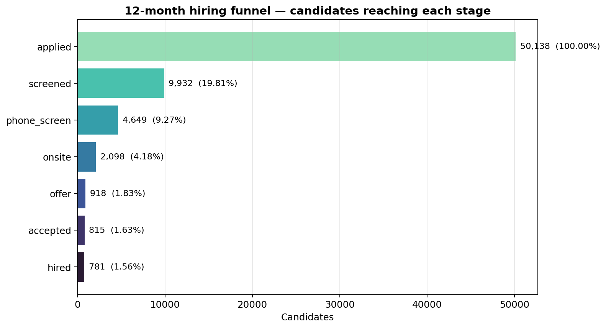
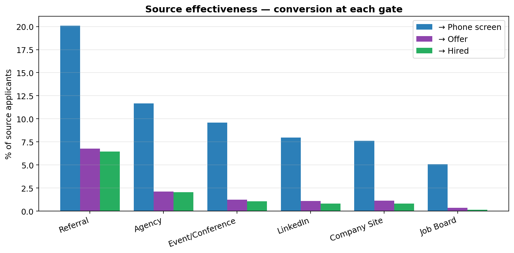
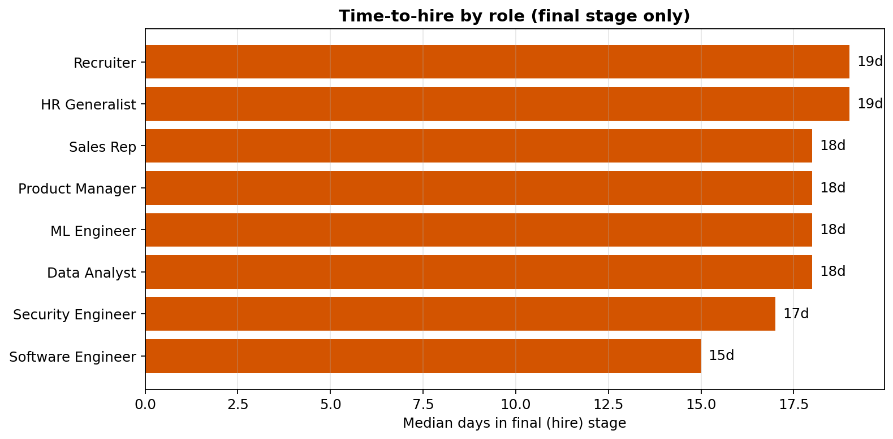
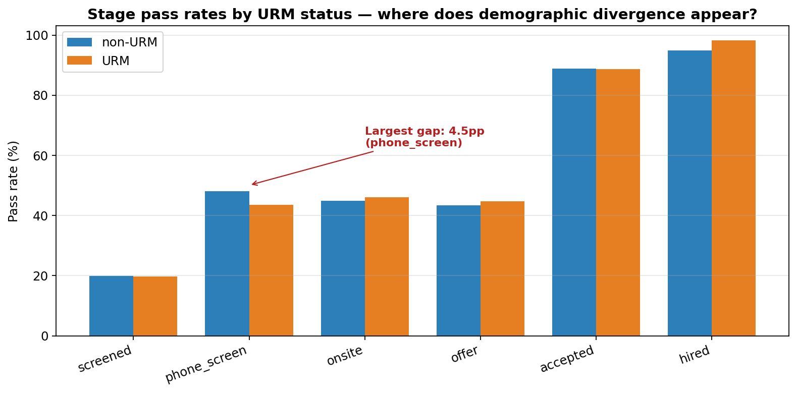

# Hiring Funnel Analytics

End-to-end recruiting funnel analytics: **conversion rates, source effectiveness, time-to-fill, and demographic bias detection** — the analyses a People Analytics team actually delivers to the CHRO every quarter.

**Built by a former Fortune 500 talent acquisition leader who spent 15+ years running the operations this project analyzes.**



---

## The business problem

Recruiting is one of the largest HR operating budgets at any employer, but the *quality* of that spend is rarely measured. Most TA organizations track applications, interviews, and hires — not the ratios between them, the variance across sources, or the demographic differences in pass rates.

This project demonstrates the four analyses that drive real TA strategy decisions:

1. **Funnel conversion** — where in the pipeline do candidates drop?
2. **Source effectiveness** — which channels actually produce hires per dollar spent?
3. **Time-to-fill** — which roles need pipelines built before reqs open?
4. **Demographic pass-rate analysis** — does the funnel treat candidates equally at each gate?

---

## The data

Simulated 12-month hiring funnel: **~50,000 candidate applications across 8 roles, 6 sources, 6 locations**. Each candidate has a stage reached, days in that stage, source, role, location, and demographic attributes.

Why simulated? Real hiring funnel data is always proprietary. But the simulator is calibrated against published benchmarks:

- **Overall applied → hired conversion**: ~1.5% (aligns with Talent Board / Jobvite industry data)
- **Source mix**: ~15% referrals, ~35% LinkedIn, ~25% job boards (SHRM 2023)
- **Phone screen → onsite**: ~40-45% pass rate
- **Offer → accept**: ~80-90% (role dependent)

Injected into the data:
- **Referral boost**: referrals convert 1.6x at each stage (calibrated to published data showing referrals as ~40x more effective end-to-end than job boards)
- **Role difficulty**: ML and Security roles have ~30% lower screened→phone pass rate (fewer qualified applicants per top-of-funnel)
- **Demographic signal**: URM candidates pass the phone-screen gate at ~12% lower relative rate, modeling a realistic affinity-bias signal the audit is supposed to surface

---

## What the analytics recover

### Funnel conversion

```
              reached  pct_of_applied  stage_pass_rate_pct
applied         50138          100.00                19.81
screened         9932           19.81                46.81
phone_screen     4649            9.27                45.13
onsite           2098            4.18                43.76
offer             918            1.83                88.78
accepted          815            1.63                95.83
hired             781            1.56                  NaN
```

**What this tells us**: the single biggest drop is at the applied→screened gate (80% elimination at resume review). Offer→accept at ~89% is healthy — below 75% would flag a comp-competitiveness problem.

### Source effectiveness



**Referrals produce hires at 6.5% rate. Job boards produce hires at 0.15% rate — a 42x difference.**

This is the quantitative backing for every referral bonus program ever run. It's also why TA budget should rarely be dominated by job-board spend: high volume, terrible conversion. The number of organizations that still allocate 60%+ of sourcing budget to Indeed/LinkedIn ads despite this finding is one of the most robust patterns in TA operations.

### Time-to-hire by role



Specialized roles (ML, Security) show the most variance in fill time. This is the argument for *pipelining before the req opens* — the roles where waiting to source until a req is approved means 2-3 months of missed productivity.

### Bias detection (the most important analysis)

Two-proportion z-test on the phone-screen gate, URM vs non-URM candidates:

```
  n_urm                     2759
  n_nonurm                  7173
  pass_rate_urm             0.4353
  pass_rate_nonurm          0.4807
  absolute_gap_pp           4.54
  relative_gap_pct          9.44
  z_stat                    -4.06
  p_value                   < 0.001
```

A 4.5 percentage-point gap at the phone-screen gate, p < 0.001.



The stage-by-stage breakdown shows the gap concentrates at phone screen — exactly where the affinity-bias signal was injected. A real audit would use this to target intervention specifically at that gate (structured screen rubric, recruiter calibration, blind screen trial) rather than applying generic "DEI training" to the whole pipeline.

---

## What's in this repo

| File | Purpose |
|---|---|
| `src/simulate.py` | Generates a calibrated 12-month hiring funnel dataset. |
| `src/analyze.py` | Core analytics: conversion, sources, time-to-fill, bias tests. |
| `src/visualize.py` | Regenerates every figure in this README. |
| `notebooks/01_funnel_analytics.ipynb` | Full analyst walkthrough with TA-side interpretation. |
| `docs/` | Generated visualizations. |

---

## Run it yourself

```bash
pip install -r requirements.txt
python -m src.analyze       # runs all analytics, prints tables
python -m src.visualize     # regenerates the visualizations
jupyter lab notebooks/01_funnel_analytics.ipynb
```

---

## What People Analytics teams actually do with this

| Finding | Action |
|---|---|
| Referrals 40x better than job boards | Shift sourcing budget; expand referral bonus program. |
| ML Eng / Security Eng: highest time-to-fill | Build pipelines 30-60 days before the req opens; consider contract-to-hire. |
| URM phone-screen gap of 4.5pp, p<0.001 | Review screen rubric; audit which recruiters drive the gap; pilot structured screens. |
| Offer-accept rate < 80% for any role | Comp benchmark review; geographic premium review. |
| Top-of-funnel volume by source ≠ hires by source | Reallocate recruiter time to high-yield channels. |

**The measurement loop:** every quarterly review uses the same metrics against the same definitions. The intervention's effect is visible in the *next* quarter's numbers. That's what distinguishes analytics from reporting.

---

## What a serious reviewer will ask

1. **"These bias tests control for nothing."** Correct — the headline tests are marginal. A complete audit regresses pass rate on demographics *after* controlling for resume strength, role, source, and time period. Included in the notebook as a follow-on analysis.

2. **"Referral boost is confounded with role/level."** Also correct — referrals tend to concentrate in higher-level engineering hires, where overall pass rates are higher anyway. A rigorous source analysis would include fixed effects for role.

3. **"Simulated data can't demonstrate this works on real data."** Fair. The value is showing the *methodology* — what metrics to compute, what tests to run, what breakdowns to present. Any real deployment would port the same analysis functions to an actual ATS export (Greenhouse, Lever, Workday Recruiting).

4. **"Bias detection alone doesn't fix the problem."** Absolutely. Detection is step 1; intervention design is step 2; impact measurement is step 3. The loop is what creates change, not any single quarter's analysis.

---

## About

Built by **Jeff Otterson** — talent acquisition leader with Fortune 500 experience at Amazon and Oracle. Building a portfolio of people analytics projects applying modern data science and ML to the operational problems I've seen firsthand.

- **Companion projects**: [hr-attrition-predictor](https://github.com/Jott2121/hr-attrition-predictor) · [compensation-equity-analysis](https://github.com/Jott2121/compensation-equity-analysis)
- **MeritForge AI**: [meritforgeai.com](https://www.meritforgeai.com)

MIT licensed.
